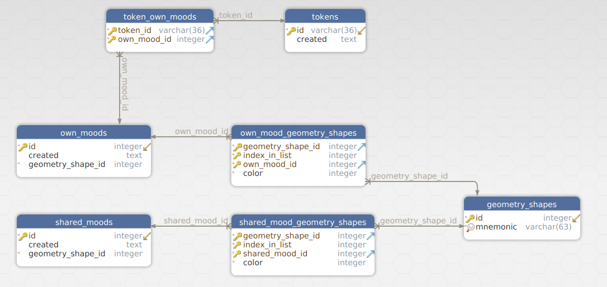

# sy

Share your mood with anyone

# The list of demos

|Folder|Implementation language|Docker demo
|------|-----------------------|-----------
|backend-java-spring-maven|Java language (Java 8 SE)|[iusalko/demo212](https://hub.docker.com/r/iusalko/demo212)
|backend-python-django|Python language (Python 3.7)|[iusalko/demo213](https://hub.docker.com/r/iusalko/demo213)
|backend-java-dropwizard-maven|Java language (Java 11 SE)|[iusalko/demo215](https://hub.docker.com/r/iusalko/demo215)

# The idea pretty simple

You write your mood in geometry shapes.

Only three shapes are available:

 1. Triangle
 2. Square
 3. Circle

Every shape is filled with color.

The result is your mood.

And you could share it with anyone.

# The database schema
